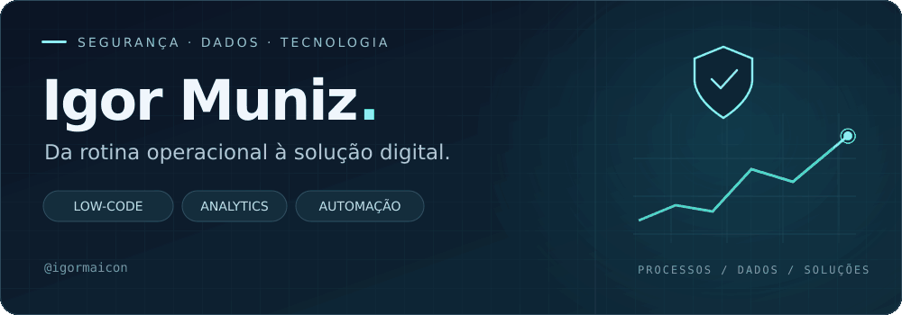
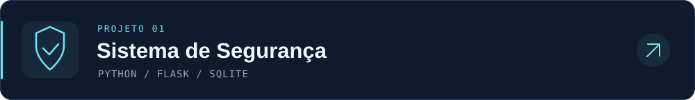
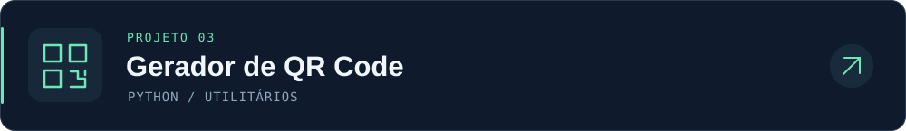

<!-- Identidade visual e assets próprios: assets/profile/ -->

  

  
  
  

## Sobre mim

Sou **Técnico de Segurança do Trabalho** e desenvolvo ferramentas digitais para apoiar a operação. Conecto o conhecimento de campo à **análise de dados, automação e desenvolvimento low-code**, criando soluções para organizar informações e acompanhar resultados.

Meu trabalho passa por três frentes:

- **Segurança e processos** — inspeções, procedimentos e acompanhamento de atividades.
- **Dados e indicadores** — bases organizadas e dashboards para apoiar decisões.
- **Soluções digitais** — aplicativos e automações para simplificar rotinas.

## Ferramentas & desenvolvimento

**Aplicações e automação**

**Dados e visualização**

## Projetos em destaque

Aplicação web em Python e Flask, com banco SQLite e funcionalidades para cadastro e gestão de colaboradores.

Extrai datas de vigência de arquivos PDF e sinaliza documentos vencidos ou próximos do vencimento.

Gera QR Codes a partir de textos ou links, com escolha do nome do arquivo de saída.

---

<strong>Tecnologia aplicada à rotina. Dados a serviço das decisões.</strong> Igor Maicon Rocha de Jesus Muniz · @igormaicon

